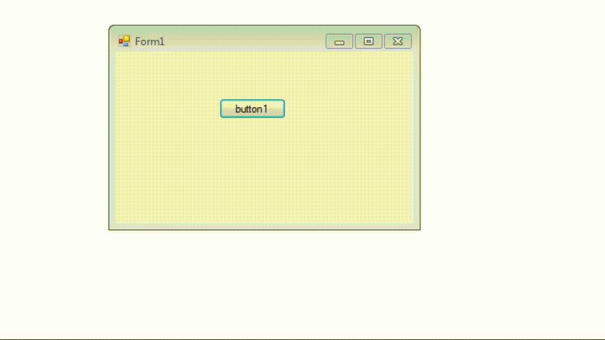

Лабораторная работа сделана в рамках ответа на вопрос на русском Stack Overflow [Как создать форму с отдельным потоком для обработки виндоус сообщений?][1].

Лабораторная демонстрирует, как можно запустить отдельный STA поток, создать в нём окно и отобразить его. При этом первый основной поток приостанавливаем при помощи `Thread.Sleep`.

  [1]: https://ru.stackoverflow.com/a/868100/11230
